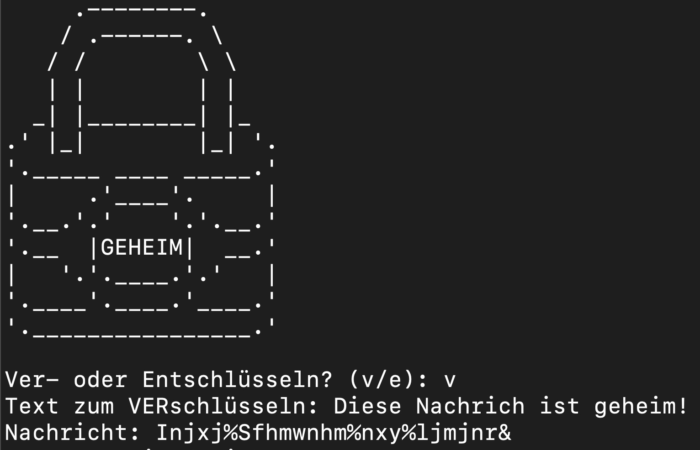

# Geheime Nachrichten erzeugen - Ein Projekt für Anfänger in C++

Du kannst alle Code-Listings direkt in deinem Browser ausführen unter [FearlessEngineers.de](https://www.fearlessengineers.de).

Eine ausführliche Beschreibung aller Code-Listings inkl. der nötigen Programmier-Basics findest du im folgenden Lernheft: 

**Worum geht es?**

In vielen Kursen zum Einstieg in die Programmierung werden die einzelnen Konzepte in einer festen Reihenfolge eingeführt: Meistens geht es los mit einer ausführlichen Einführung in Datentypen und Operatoren sowie Dinge wie Konstanten, Typumwandlungen oder Speicherbedarf.

Das Problem mit dieser Art von Einstieg ist, dass es eine ganze Weile dauert, bis du zu spannenden Themen kommst und etwas greifbares mit deinen neuen Fähigkeiten entwickeln kannst.

Das Lernheft "Lerne Programmieren mit Projekten: C++" geht einen anderen Weg: Du lernst Programmieren an echten Projekten und wirst dir nur diejenigen Grundlagen anschauen, die für die Umsetzung des Projekts unbedingt nötig sind.

In diesem ersten Projekt wirst du ein Programm zur Verschlüsselung von Textnachrichten schreiben, mit dem du geheime Codes erzeugen kannst, die ohne die richtige Entschlüsselung auf den ersten (und zweiten) Blick nicht lesbar sind.

**Das kannst du nach diesem Kapitel:**

- Das Grundgerüst eines Programms schreiben.
- Variablen definieren und mit Operatoren verändern und vergleichen.
- Den Verlauf deines Programms beeinflussen.
- Anweisungen mit Hilfe einer Schleife beliebig oft wiederholen.

---

Die Umsetzung des Projekts besteht aus 4 Teilen, die im Lernheft ab Seite 43 detailliert beschrieben sind.

Fragen und Anregungen gerne an kontakt@andreashaja.com.
